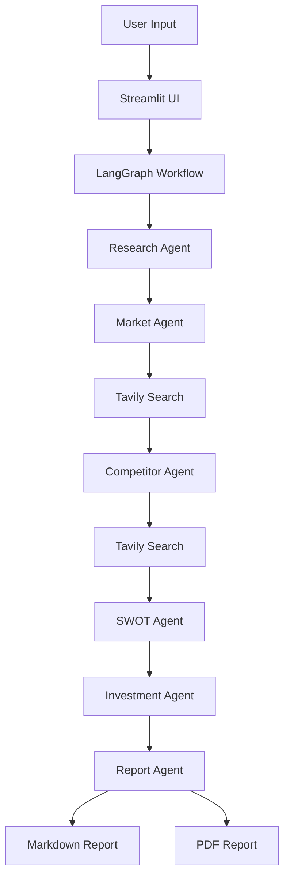

# 🚀 Multi-Agent Startup Analyzer

An AI-powered startup evaluation platform built using LangGraph, Gemini, Tavily Search, and Streamlit.

The system uses multiple specialized AI agents to analyze startup ideas, perform market research, identify competitors, generate SWOT analysis, evaluate investment potential, and create professional reports.

---

## 🌟 Features

### Research Agent

* Identifies Industry
* Determines Business Model
* Detects Target Market

### Market Agent

* Real-time market research using Tavily Search
* Market size estimation
* Growth trends analysis
* Opportunities and risks identification

### Competitor Agent

* Finds industry competitors
* Competitor benchmarking
* Competitive threat analysis

### SWOT Agent

* Strengths
* Weaknesses
* Opportunities
* Threats

### Investment Agent

* Investment Score
* Risk Score
* Recommendation
* Investment reasoning

### Report Agent

* Generates professional startup reports
* Markdown export
* PDF export

### Streamlit Dashboard

* Interactive UI
* Real-time startup analysis
* Downloadable reports

---

## 🏗️ Project Architecture

```text
User Input
     │
     ▼
Streamlit UI
     │
     ▼
LangGraph Workflow
     │
     ├── Research Agent
     │
     ├── Market Agent
     │       │
     │       └── Tavily Search
     │
     ├── Competitor Agent
     │       │
     │       └── Tavily Search
     │
     ├── SWOT Agent
     │
     ├── Investment Agent
     │
     └── Report Agent
     │
     ▼
Startup Analysis Report
     │
     ├── Markdown
     └── PDF
```

---

## 🛠️ Tech Stack

### AI & Agent Framework

* LangGraph
* LangChain
* Google Gemini

### Search & Intelligence

* Tavily Search API

### Frontend

* Streamlit

### Backend

* Python

### Reporting

* Markdown
* PDF Generation

---

## 📂 Project Structure

```text
startup-analyzer/

├── agents/
│   ├── research_agent.py
│   ├── market_agent.py
│   ├── competitor_agent.py
│   ├── swot_agent.py
│   ├── investment_agent.py
│   └── report_agent.py
│
├── graph/
│   └── startup_graph.py
│
├── prompts/
│
├── services/
│
├── tools/
│
├── ui/
│   └── streamlit_app.py
│
├── reports/
│
├── app/
│
├── requirements.txt
│
└── README.md
```

---

## ⚙️ Installation

### Clone Repository

```bash
git clone https://github.com/your-username/startup-analyzer.git
cd startup-analyzer
```

### Create Virtual Environment

```bash
py -3.12 -m venv venv312
```

### Activate Environment

```bash
venv312\Scripts\activate
```

### Install Dependencies

```bash
pip install -r requirements.txt
```

---

## 🔑 Environment Variables

Create a `.env` file:

```env
GOOGLE_API_KEY=YOUR_GEMINI_API_KEY
TAVILY_API_KEY=YOUR_TAVILY_API_KEY
```

---

## ▶️ Run Streamlit

```bash
streamlit run ui/streamlit_app.py
```

---

## 📊 Example Startup

Startup Name:

```text
MediAI
```

Description:

```text
AI-powered disease prediction platform for healthcare providers.
```

---

## 📈 Future Improvements

* Startup valuation model
* Investor matching agent
* Pitch deck generation
* Financial forecasting
* Multi-user authentication
* Database integration
* API deployment

---




## 👨‍💻 Author

Devashish Shankar

MTech Data Science & AI

NIT Durgapur
